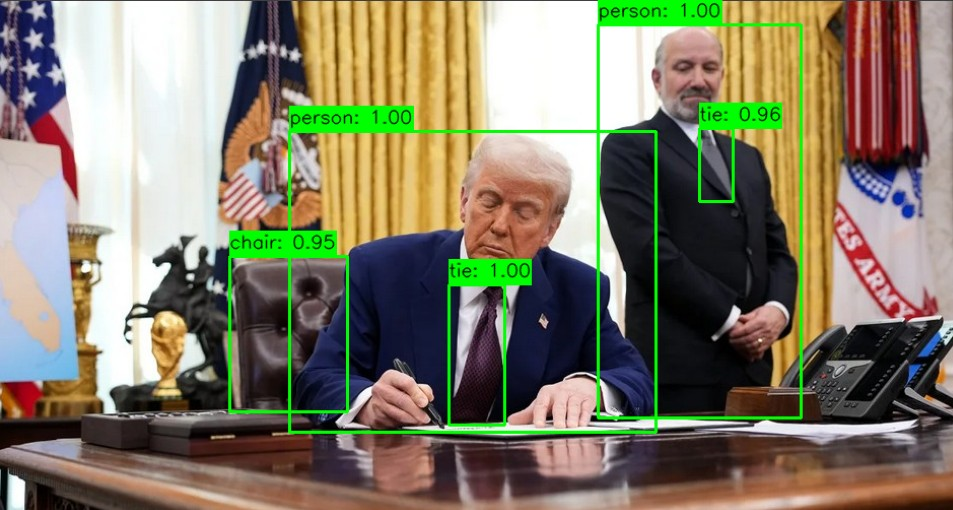

Using the DEtection TRansformer (DETR) model to 
identy objects in pictures.  
Code <a href="EndToEndObjectDetection.py">here</a>. 
 
Beijing Street life: 
 
 
February, 2025, The Oval Office. 
 
 
February, 2025, The Oval Office. 
 
 
